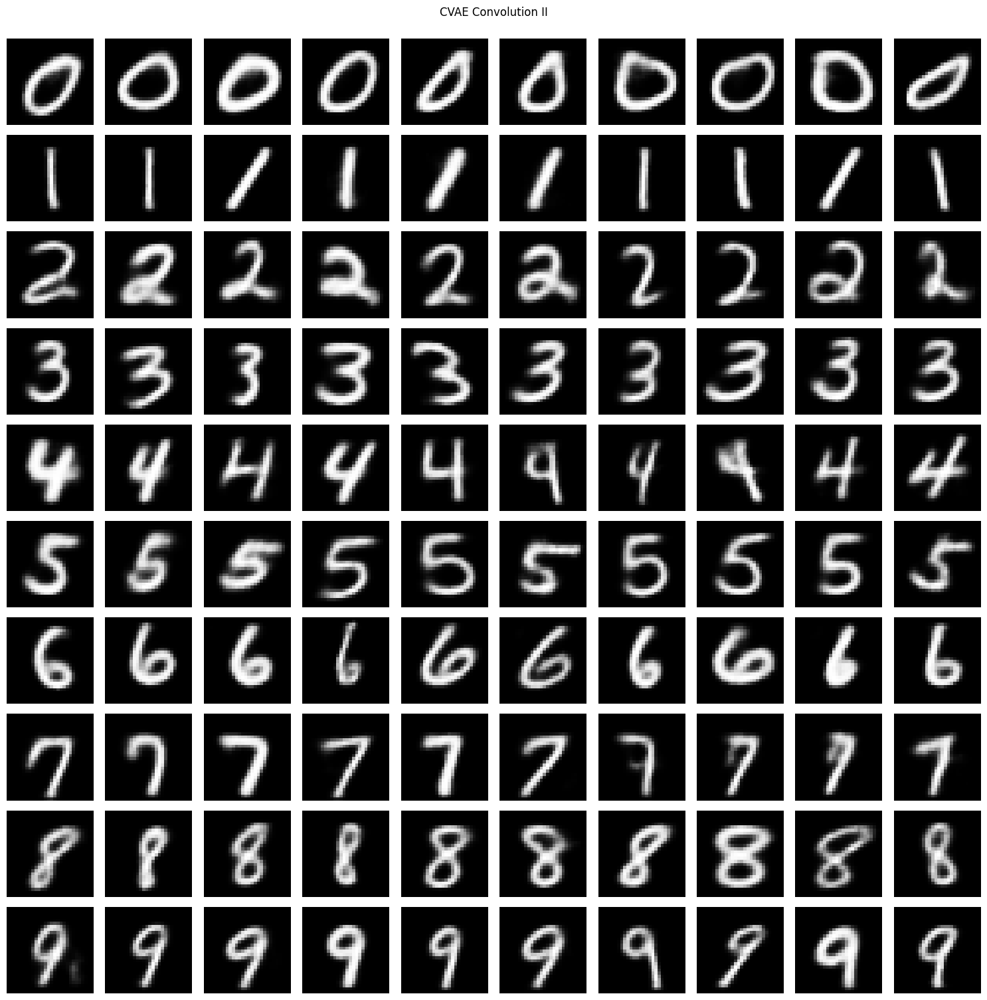

# Conditional Variational Autoenoder on MNIST

CVAE paper: [Semi-supervised Learning with Deep Generative Models](https://proceedings.neurips.cc/paper/2014/hash/d523773c6b194f37b938d340d5d02232-Abstract.html)

## 📌 Project Overview
This project implements a **Conditional Variational Autoencoder (CVAE)** on the **MNIST dataset**. A CVAE is a probabilistic generative model that learns to reconstruct and generate images given a condition, in this case, the digit label.

The goal of this project is to demonstrate the power of **variational inference** in deep learning and how CVAEs can be used for **image generation and representation learning**.

## 🎯 Results

After training, the model should be able to generate new MNIST digits conditioned on the class label. Example of generated images:

## 📌 Future Improvements

Improve latent space representation.
Tune hyperparameters for better image quality.
Experiment with different architectures (e.g., deeper CNN layers).